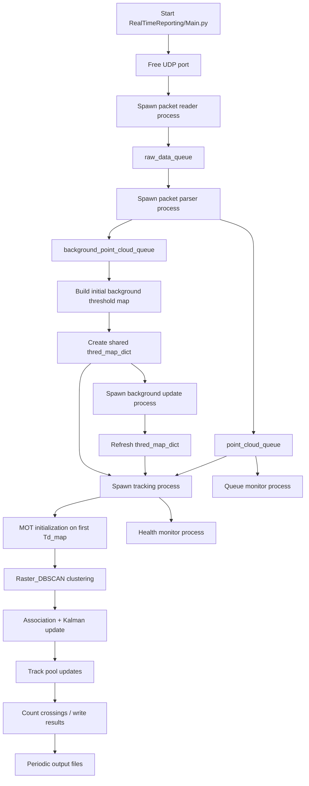
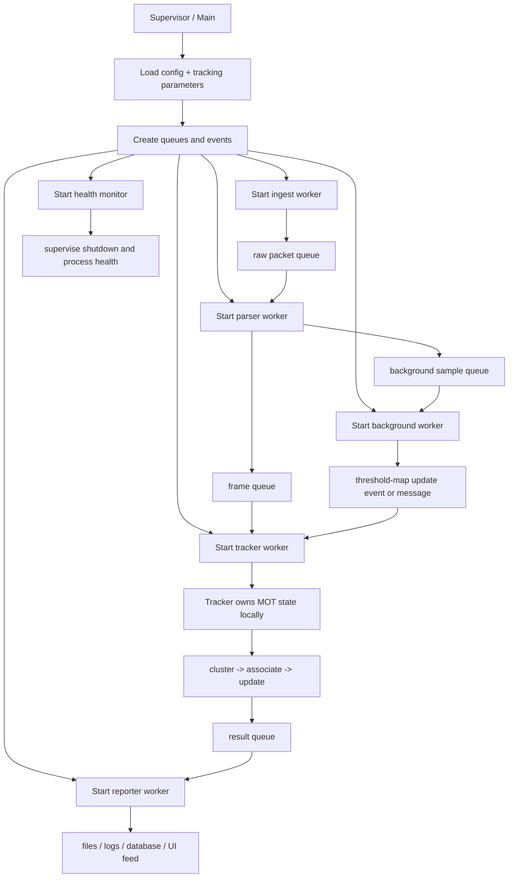

# RealTimeReporting System Overview

This folder contains the real-time LiDAR ingest, parsing, tracking, background updating, and reporting pipeline.

## Purpose

The runtime is organized as a multiprocessing system that:

- reads UDP packets from the LiDAR sensor
- parses packets into frame-level point-cloud / Td-map data
- initializes and updates tracking state
- refreshes the background threshold map over time
- reports counts and health information

## Current Workflow

## Proposed Workflow

## Core Modules

- `Main.py`: process orchestration and lifecycle management
- `LiDARBase.py`: packet parsing, point-cloud framing, and geometry helpers
- `MOT_TD_BCKONLIONE.py`: tracking state machine and Kalman-style update loop
- `GenBckFile.py`: background threshold generation
- `Utils.py`: shared helper functions used by the runtime pipeline

## Data Flow Summary

1. `Main.py` frees the UDP port and starts packet ingest.
2. Raw packets are queued and parsed into frame-level data.
3. A threshold map is generated from background samples.
4. The tracker consumes frames, performs clustering, then associates and updates tracks.
5. The background worker periodically refreshes the threshold map.
6. Results are written out by the tracking/reporting logic and monitored by health and queue watchers.

## Important Notes

- The tracking process should own its own MOT state.
- `Main.py` should stay a thin orchestrator.
- Reporting should be separated from tracking when possible.
- The current code mixes process supervision, tracking, counting, and reporting in a way that is harder to maintain than the proposed structure.
- Some modules are imported from the repository root `RaspberryPi/` folder, so this runtime is not fully self-contained inside `RealTimeReporting/`.

## Reading Order

1. `Main.py`
2. `LiDARBase.py`
3. `MOT_TD_BCKONLIONE.py`
4. `GenBckFile.py`
5. `Utils.py`
6. `MySQLConnector.py`
7. `ProcessTest.py`
8. `TestSocket.py`

## Suggested Boundary Split

- Supervisor: startup, shutdown, queue wiring, health monitoring
- Ingest worker: UDP packet reading only
- Parser worker: raw packet to frame conversion only
- Tracker worker: MOT lifecycle and per-frame updates only
- Background worker: threshold-map generation only
- Reporter worker: file/database output only
